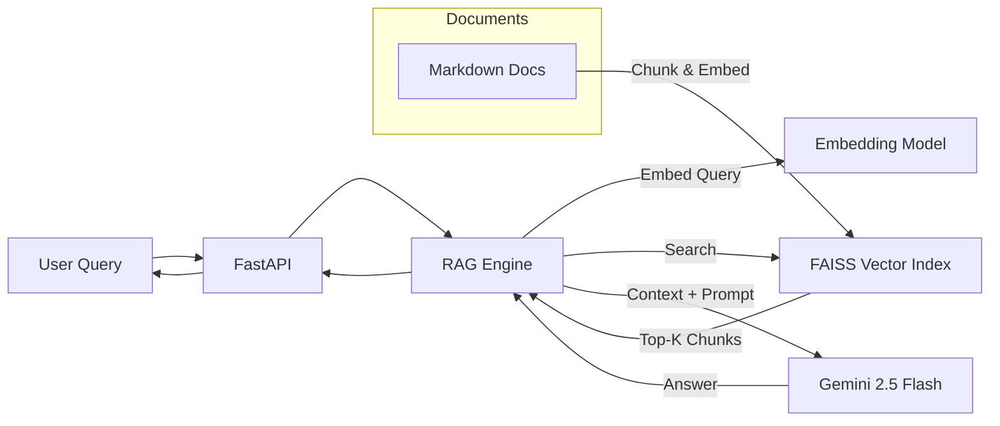

# Engineering Docs RAG (Gemini-powered)

A **Retrieval-Augmented Generation (RAG)** system for querying engineering documentation using **semantic search (FAISS)** and **Gemini 2.5 Flash**.  
Designed to simulate an **internal enterprise knowledge assistant** for engineering teams.

---

## Features

- Ingests Markdown engineering documents
- Section-based chunking with metadata
- Semantic embeddings for document chunks
- FAISS-based vector similarity search
- Gemini-powered grounded answer generation
- Isolated test suite and model inspection utilities
- Secure API key management via environment variables

---

## System Architecture


---

## Setup Instructions

### Clone the repository
```bash
git clone https://github.com/DeadBoTt-exe/DocuMind-AI.git
```

### Create and activate a virtual environment
```bash
python -m venv .venv
```

Windows
```bash
.venv\Scripts\activate
```

macOS / Linux
```bash
source .venv/bin/activate
```

### Install dependencies

```python
pip install -r requirements.txt
```

### Configure environment variables

Create a .env file in the project root:
```bash
GEMINI_API_KEY=your_api_key_here
```
---

## Running the RAG Engine

Run the test to verify the full RAG pipeline:
```python
python -m tests.test_rag
```

---

## Running the API

Start the FastAPI server:
```bash
uvicorn app.main:app --reload
```

Open your browser at:
```bash
http://127.0.0.1:8000/docs
```

---

## Testing

- Tests are located in the tests/ 
- Current tests validate end-to-end retrieval and generation

Model availability can be inspected via:
```python
python tests/list_available_models.py
```

---

## Working

- Engineering docs are loaded and chunked by section
- Chunks are embedded into vector space
- FAISS indexes embeddings for fast similarity search
- Relevant chunks are retrieved for a query
- Gemini generates an answer using only retrieved context
- Sources are returned alongside the answer

